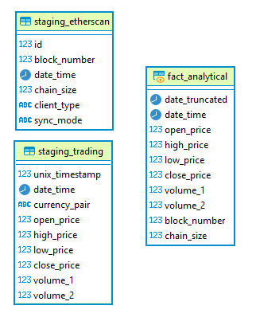
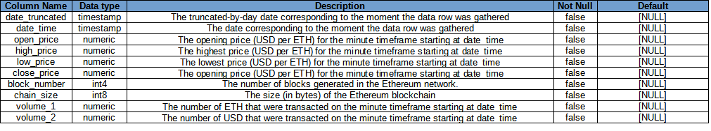

# Udacity DE Nanodegree - Capstone Project - Write Up

### Project Scope and Data Gathering

Choosing a dataset different from the ones proposed by Udacity can be a daunting task. Nevertheless, starting by using domain knowledge can be a good starting point. By following this path, a crypturrency dataset was chosen for this project, which is comprised of the following sources:

- ETH-USD (Ethereum-United States Dollar) price and trading volume per-minute data for Binance cryptocurrency exchange, years 2019 to 2021, in CSV format. Available [here](https://www.cryptodatadownload.com/data/bitstamp/). This dataset has more than one million rows, which makes this project fulfill the one-million-row threshold in place for the capstone.
- Ethereum Nodes size, as per Etherscan's [API](https://docs.etherscan.io/api-endpoints/stats-1). As this data source is API-based, and taking into account the previous CSV data source, the requisite for two different data sources is fulfilled.

The main purpose of this initiative is to create an analytical database, so that it supports further decision making
towards Ethereum cryptocurrency.

### Data Assessment and Exploration

This will be found in detail in the [Jupyter notebook](./Udacity-CP.ipynb), which is stored in the same folder as this file. Nevertheless, the following can be stated:

- **Data exploration**: both aforementioned datasets were explored in order to check data integrity and look for any potential issues with the dataset (e.g. non-unique valued columns, inconsistencies with what domain knowledge suggests about a column, etc.);
- **Data quality**: in addition to what is done in the previos section, some formal data quality checks were performed.

### Data Model

As the purpose of this project is to provide an analytical database, it was decided there will be 2 groups of tables/views:

- **Staging tables**: these tables correspond to the datasets that are used in this project. These tables are mixed fact-dimension tables, whose names begin with "staging";
- **Fact view**: this is the main table of the database.



Above lies the database schema. It can be noted that there are no integrity constraints in place because:

- The quality checks suffice for keeping data integrity;
- The ```fact_analytical``` view's query does the other part in keeping integrity.


These are the data definition tables for the above data model:

- ```staging_etherscan```:


- ```staging_trading```:


- ```fact_analytical```:


### ETL run

As mentioned before, the ETL is run with this [Jupyter notebook](./Udacity-CP.ipynb), which includes:

- Data quality checks;
- Source/count checks;
- Definition of the columns of the dtasets, i.e. data dictionaries.

This is a one-time ETL. Nevertheless, in order to keep it updated on a minute-by-minue basis (which is the suggested update frequency), there are some steps to be followed; please refer to the [Scheduled runs needs: Airflow approach](#Scheduled-runs-needs:-Airflow-approach) section for more information on those steps.

### Expected queries to run on the database

These are a couple of examples for queries that can be run with the fact table of this database:

- Average gap (max - min) price of Ethereum for a given day/month/year;
- Average gap (max - min) price of Ethereum for a given day/month/year, weighted on the USD transacted;
- Total voluem in ETH or USD transacted on a given day/month/year;
- Correlation betweeen daily percent change on the Ethereum blockchain and daily percent change on ETH price.

### Tech/tools stack

Due to the size of the data and the concurrency needs (1-10 users), an EC2 ```t2.micro``` instance with 20 Gb storage space and a 4 Gb swapfile with cronjobs can be used for the ETL, which falls in the free tier of AWS. As for the Postgres DB used in the project, a free-tier RDS instance would suffice.

### Other scenarios
What if:

- The data was increased by 100x?
- The pipelines would be run on a daily basis by 7 am every day?
- The database needed to be accessed by 100+ people?

#### Scheduled runs needs: Airflow approach

As for the potential use of Apache Airflow for updating this database:

- **Trading data**: an Apache Airflow DAG would be executed on a minute-by-minute basis, which fetches trading data from [Bitstamp's API](https://www.bitstamp.net/api/) and updates the ```staging_trading``` table with proper SQL query;
- **Etherscan data**: an Apache Airflow DAG would be executed on a daily basis at, e.g., 7 AM, which fetches data from [Etherscan's API](https://docs.etherscan.io/api-endpoints) and updates the ```staging_etherscan``` table with proper SQL query.

This approach, by the way, solves the potential need of daily updates for the data.

#### Concurrency increase: Bigger RDS instance/Redshift approach

It is possible that a lot of people (e,g, 100+) need to access the data. There are a copuple of solutions for that increased workload:

- **Bigger RDS instance**: this is a naïve approach beause there will be a limit on the vertical growth of a relational database;
- **Redshift instance**: this is the correct approach for scalating the capabilities of an analytical database, as it is horizontally scalable.

#### Bigger datasets: S3 + Spark approach

The trading dataset weighs 131 Mb. What if that dataset were 13.1 Gb? It may be too big for it to be stored in an Apache Airflow EC2 instance, for example. A good approach for thiw would be:

1. Store the data in an S3 bucket;
2. Use an Spark cluster for performing data exploration, data quality checks and storing it in an RDS or a Redshift cluster.

